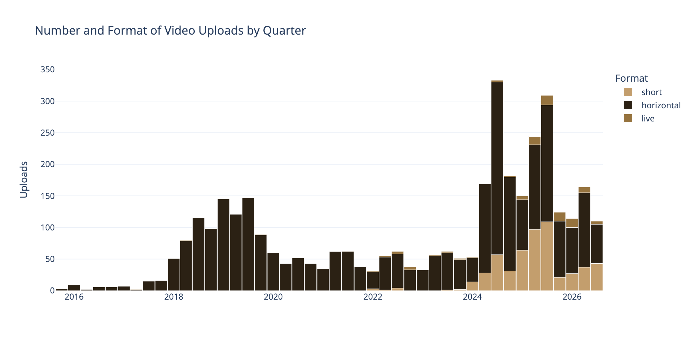
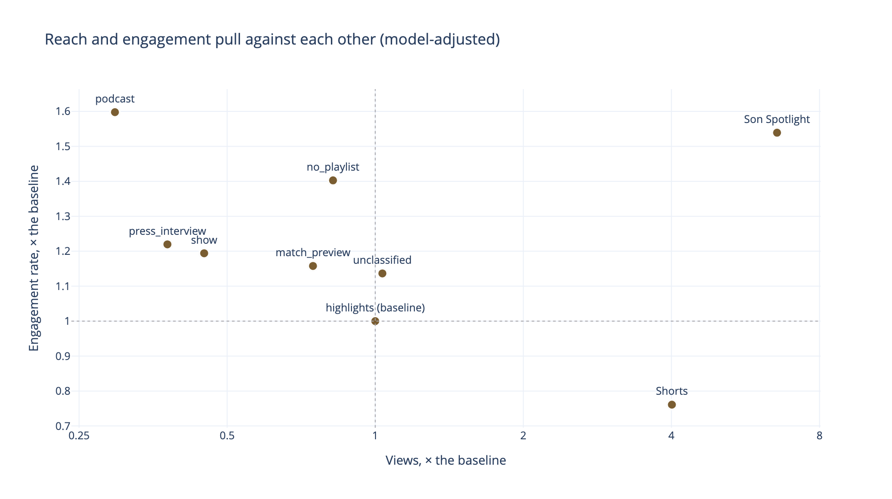
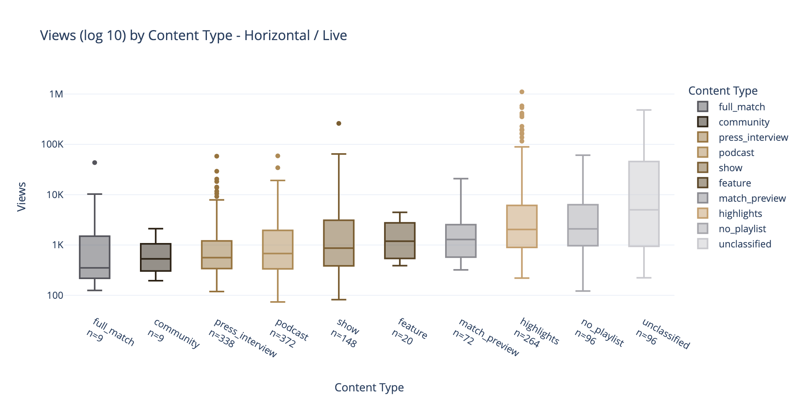
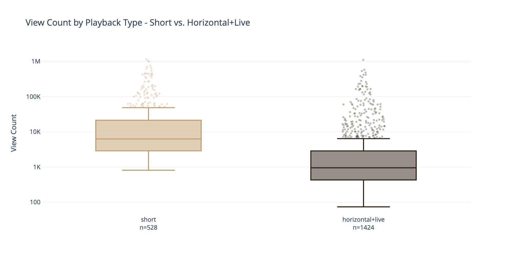
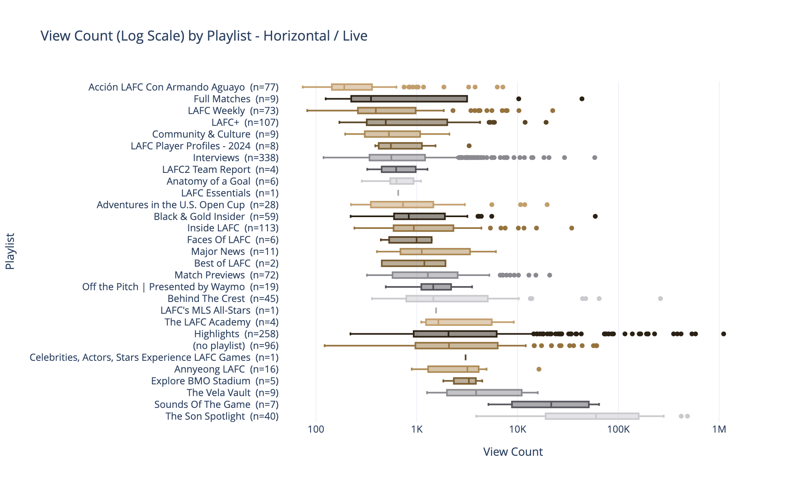
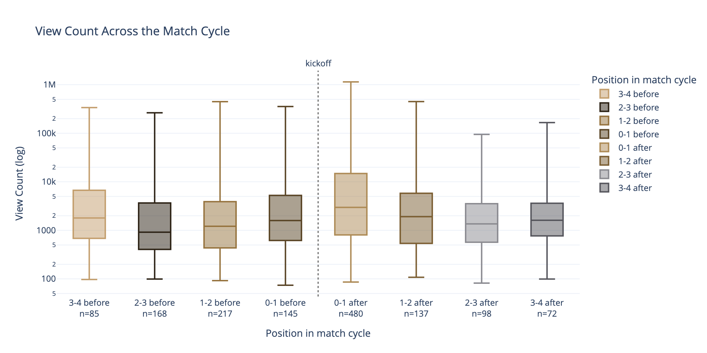

# Findings

Results by lever. Method, labelling and conventions live in [method.md](method.md); scope and definitions are in the [README](../README.md).

**1,952 videos, 2024-01-02 to 2026-08-13**, from a library of 3,648. Every table and model on this page runs on `sql/videos_vs_lafc_match_context.sql`, which joins each video to its nearest LAFC match, before or after.

**Every model number compares videos published in the same quarter.** The channel's audience grew during the window, so a view count from 2024 and one from 2026 are not directly comparable. Both models include a publish-quarter term to handle that. Without it the Son Spotlight number reads ×36 instead of ×6.6.

## Contents

- [Context — what the team did not control](#context--what-the-team-did-not-control)
- [Reach and engagement pull against each other](#reach-and-engagement-pull-against-each-other)
- [Format](#format)
- [Subject](#subject)
- [Timing](#timing)
- [Revision history](#revision-history)

---

## Context — what the team did not control

### The Son signing lifted the whole channel

Median views per video by publish quarter step up sharply in 2025Q3 and stay above pre-signing levels.

| quarter | videos | median views |
|---|---|---|
| 2024Q3 | 333 | 622 |
| 2025Q1 | 150 | 1,349 |
| 2025Q2 | 244 | 1,419 |
| **2025Q3** | 309 | **8,103** |
| 2025Q4 | 124 | 4,152 |
| 2026Q2 | 164 | 2,216 |

Son Heung-min's first LAFC video — his introductory press conference — is 2025-08-06. Splitting 2025Q3 at that date puts the break *inside* a single quarter, which rules out gradual growth.

| 2025Q3 | videos | median views |
|---|---|---|
| before Son | 113 | 1,020 |
| after Son | 196 | 33,915 |

**The lift reached content that has nothing to do with Son.** 47 videos published in August 2025 are neither in the Son Spotlight playlist nor mention him anywhere in the title or description. Their median goes from **820 views in July to 14,479 in August** — ×17.7. Uploads stayed flat over the same stretch, 100 → 103.

**It is not the Shorts mix either.** Holding playback type constant, horizontal and live video goes 539 → 6,295 and Shorts 5,525 → 31,854. Both jump, so a rising Shorts share cannot explain it.

Excluding the playlist alone would not have been strict enough — 27% of the remaining August videos still name him. 

**What this cannot establish.** Same-day causation is not provable from observational data — anything else happening on 2025-08-06 would look identical. The introductory press conference on that date is what makes it convincing, not the statistics. Nor can Son the *content subject* be cleanly separated from Son the *era*: he substantially caused the period he is being controlled for.

### Two strategy shifts moved output, not reach

LAFC's format strategy changed twice, and neither move shifted per-video reach.

**2024Q1 — Shorts adopted.** Shorts go from 3.9% of uploads in 2023Q4 to 26.4% in 2024Q1 and never return to the old level. Annual volume goes from 202 videos in 2023 to 737 in 2024.

**2025Q1 — live becomes routine.** Shorts share spikes to 42.7% and live goes from 6 videos a year to 6 a quarter.

**Median views fell through the ramp** — 2,323 in 2024Q1 down to 501 in Q2 — and did not recover until the signing eighteen months later. The levers the content team controlled changed *what was published*; they did not change how many people watched.

This is also one reason why the analysis window starts at 2024: before 2024Q1 the channel was single-format.

---

## Reach and engagement pull against each other

Two models demonstrated this effect. In both, each format, content type and timing window is measured against a single reference case: a **long-form highlights package published the day before a match, in 2024Q1.** 

Here's how I chose the reference case.

Three choices:

- **`highlights` for content type.** It is the largest group (310 videos), so the reference is measured precisely, and it sits near the top on views — which means most other types read as "how far below highlights."
- **0–1 days before a match for timing.** It is the weakest window for views, so every other window comes out positive and reads as a lift rather than a penalty.
- **Long-form, and not Son.** Those two are yes/no flags, so the reference is simply the "no" case for each.

The fourth was not a choice. Statsmodels takes the alphabetically first quarter as its reference, which is **2024Q1**, the earliest in the window.

The models put the metrics for the reference case at roughly **1,500 views** at a **3.65%** engagement rate.

Now changing one thing about that video, holding everything else steady:

| change one thing | views | engagement |
|---|---|---|
| put it on the Shorts feed | **×4.01** | **−0.87 pts** |
| make it a Son Spotlight video | **×6.56** | **+1.97 pts** |
| make it a podcast instead | **×0.30** | **+2.18 pts** |
| make it a press interview instead | **×0.38** | **+0.80 pts** |
| make it a show instead | **×0.45** | **+0.71 pts** |

Every row is significant at p<0.005 on both measures. So a podcast gets about 450 views where the highlights package gets 1,500, and 5.83% engagement where it gets 3.65%.

Four other content types — `no_playlist`, `match_preview`, `unclassified` and `feature` — land between ×0.75 and ×1.03 on views with intervals crossing 1, so they are not read here.

Views are multipliers because that model predicts views on a log scale; engagement is in percentage points because that model predicts the rate directly.

Every lever sits in one of two quadrants — it bought reach at the cost of engagement, or the reverse. Only the Son Spotlight sits top-right.

**Implication:** "what should we make?" has no single answer — it depends which metric is the goal. Highlights and Shorts buy reach but not engagement; podcasts and interviews do the reverse.

The same split shows up in the raw medians. A podcast gets a quarter of a highlights package's views and nearly twice its engagement rate — 677 views against 2,686, and 6.11% engagement against 3.48%, across 372 podcasts. `press_interview` and `show` sit between the two on both measures.

| content type | videos | median views | median engagement |
|---|---|---|---|
| `unclassified` | 125 | 16,216 | 5.34% |
| `no_playlist` | 548 | 4,714 | 4.96% |
| `highlights` | 310 | 2,686 | 3.48% |
| `match_preview` | 73 | 1,294 | 4.54% |
| `show` | 148 | 866 | 4.78% |
| `podcast` | 372 | 677 | 6.11% |
| `press_interview` | 338 | 561 | 4.73% |

**Two caveats on the models.** The engagement model explains much less than the views model (R² 0.213 against 0.636) — these predictors say more about who *sees* a video than about who *reacts* to it. And a large part of the views model's R² comes from the ten publish-quarter terms, which describe *when* a video went out rather than anything about the video itself.

---

## Format

### Shorts are the views engine — the feed, not the length

| format | videos | median views | median engagement |
|---|---|---|---|
| short | 528 | **6,291** | 4.60% |
| live | 82 | 2,023 | 6.14% |
| horizontal | 1,342 | 914 | 4.97% |

After controlling for content type, match-cycle position and publish quarter, Shorts get **×4.0 the views** of horizontal and live video (CI [3.28, 4.90], p<0.001) and **0.87 percentage points less** engagement (CI [−1.27, −0.48], p<0.001).

**Treat `format` as Shorts vs everything else**, grouping `live` in with `horizontal`. See [method.md](method.md#format-is-a-delivery-method-not-a-content-category) for why reporting three formats is misleading.

### Duration inside long-form runs the other way

"Short-form wins" is about the **Shorts feed**, not about length. Outside that feed, the relationship runs the other way.

Duration and content type are nearly the same variable in long-form:

| content type | n | median duration |
|---|---|---|
| `highlights` | 264 | 1.0 min |
| `press_interview` | 338 | 8.4 min |
| `show` | 148 | 21.0 min |
| `podcast` | 372 | 38.2 min |

So the test has to run *inside* a single content type, where length is the only thing still varying. Within highlights:

| band | n | median duration | median views |
|---|---|---|---|
| under 1 min | 112 | 0.80 min | 1,175 |
| 1–3 min | 70 | 1.12 min | 1,285 |
| 3–10 min | 79 | 6.02 min | **5,752** |

A highlights package **7.5× longer gets ×4.9 the views** — a full match package beats a single goal clip. (The 10–30 min band is n=3 and is not read here.)

**Implication.** Reading "short-form is the reach engine" as *make everything shorter* would be wrong. The lever is *publish to the Shorts feed*, and separately, *don't truncate a highlights package*.

---

## Subject

Subject is which playlist a video is filed under, when that playlist is about a person or a theme rather than a kind of video. It is a separate axis from `content_type` — the Son Spotlight's content type is literally `unclassified`.

### The Son Spotlight is the only lever that gains on both

| | n | median views |
|---|---|---|
| The Son Spotlight | 69 | **84,187** |
| everything else | 1,883 | 1,657 |

After controls the playlist runs **×6.6 the views** (CI [4.15, 10.35], p<0.001) and **+1.97 points** of engagement (CI [+1.07, +2.86], p<0.001). Every other lever in either model trades one metric for the other; this one does not.

**The size depends on how finely I control for time, and no version settles it:** ×36 with no time term, ×6.6 with quarterly terms, ×3.3 with monthly terms. Monthly fits best and I rejected it anyway — 39 of the 69 Son videos share one month, so an August-2025 term is nearly a Son term and swallows what I'm trying to measure. Read ×6.6 as *Son videos against other videos published the same quarter*. The signing's effect on the whole channel is a separate and much larger thing, and it is in [Context](#context--what-the-team-did-not-control).

**What this cannot tell us.** Whether this is *player content* generally or *Son* specifically. The Vela Vault is the only comparable player-subject playlist and has 9 videos in this window (median 3,877 — roughly 2× the library median, so player content may help generally, but far below Son). Settling it would need more player-subject playlists, or a player tag read from the title. It is the biggest open question in the analysis.

`unclassified` illustrates the same point from the other side. It tops the raw medians at 16,216 views and collapses to ×1.03 in the model, CI [0.72, 1.48]. 61 of its 117 videos are the Son Spotlight, which `is_son` now accounts for directly; the remaining 56 are a mix of unrelated playlists with no single effect to measure.

---

## Timing

Position in the cycle is measured against the **nearest** kickoff in either direction — negative before a match, positive after. So "0–1 day before" means published in the 24 hours leading up to a match, and "0–1 day after" the 24 hours following one.

### Views and engagement peak at opposite ends of the cycle

| position in cycle | videos | median views | median engagement |
|---|---|---|---|
| 3–4 days before | 85 | 1,801 | 4.79% |
| 2–3 days before | 168 | 915 | 5.45% |
| 1–2 days before | 217 | 1,212 | 5.17% |
| **0–1 day before** | 145 | 1,593 | **5.64%** |
| **0–1 day after** | 480 | **2,976** | 3.99% |
| 1–2 days after | 137 | 1,912 | 5.32% |
| 2–3 days after | 98 | 1,357 | 5.17% |
| 3–4 days after | 72 | 1,611 | 4.83% |

In the model, for views, every window beats the 24 hours before kickoff — but in a narrow band, **×1.43 to ×1.88**. The day after kickoff is the highest at ×1.88 (p<0.001), and days three to four are still ×1.80. What the data supports is that **the day before a match is the weakest slot for views**.

Engagement runs the other way. All nine windows come out below the 24 hours before kickoff. Most are not individually significant, but nine out of nine pointing the same way is the pattern. The clearest is the day after kickoff at **−0.91 points** (p<0.001) — the views peak and the engagement low point are the same window.

Engagement rate is (likes + comments) divided by views, so a rush of casual viewers after a match grows the bottom of that fraction faster than the top. The post-match engagement dip is mostly a **reach** story, not people caring less.

### Why the nearest match, and not the last one

Measuring only backwards mislabels build-up content. **43% of videos are closer to the next match than the previous one**, so a hype clip posted the night before kickoff used to be recorded as "5 days since the previous match."

The fix is `days_from_match`, which takes whichever kickoff is closer and signs it — negative before a match, positive after. Videos more than 21 days from any match in either direction are treated as offseason and dropped.
